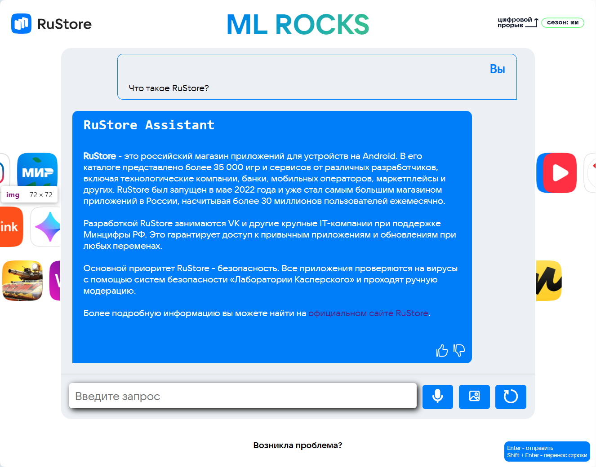

# Решение задачи умной документации RuStore

Команда: ML Rocks

Контакт для связи: https://t.me/dl_hello

# Запуск

1. Скопируйте репозиторий
2. Установите зависимости

```bash
pip install -r requirements.txt
```

3. Запуск

```bash
uvicorn main:app
```

**!Внимание!**: По умолчанию дополнительные функции: анализ по речи и анализ по изображению выключены, так как для тестирования мне нельзя было нагружать сильно систему. Чтобы включить данные функции, перейдите в файл `tools.py` и раскомментируйте 4 строки в начале кода.
